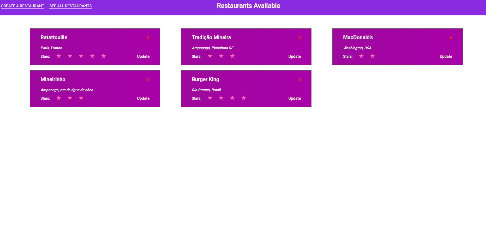
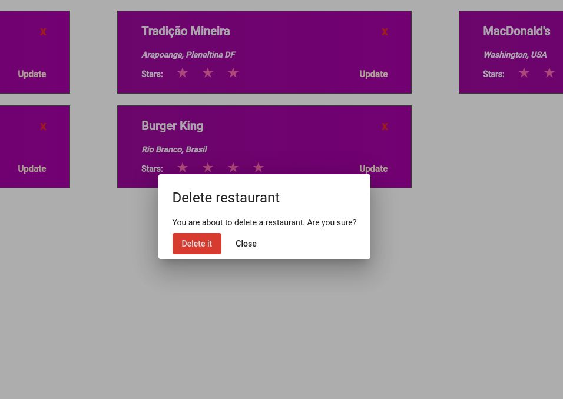
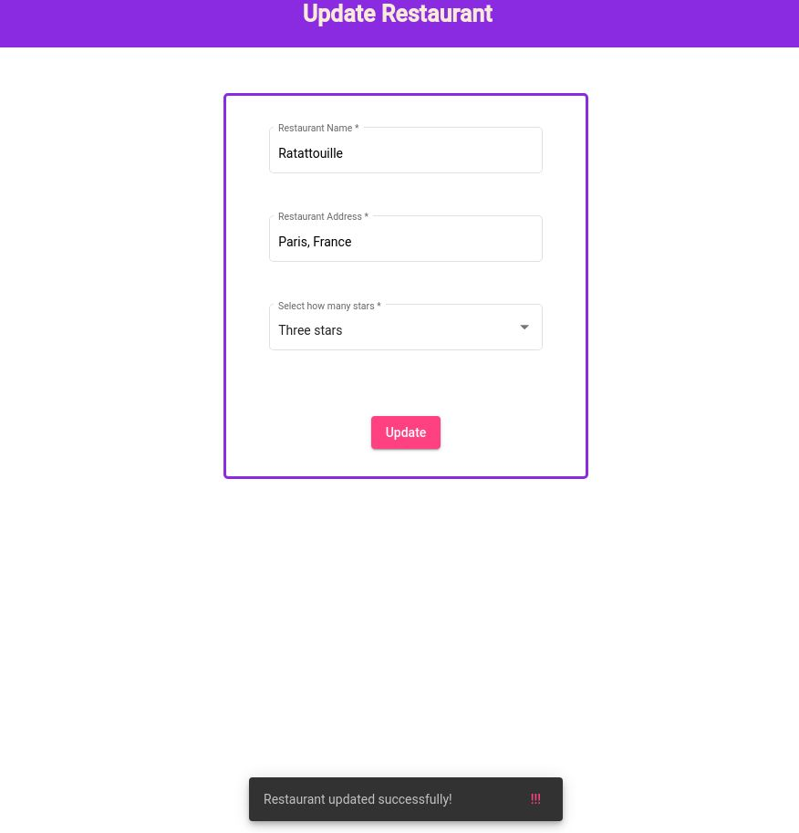
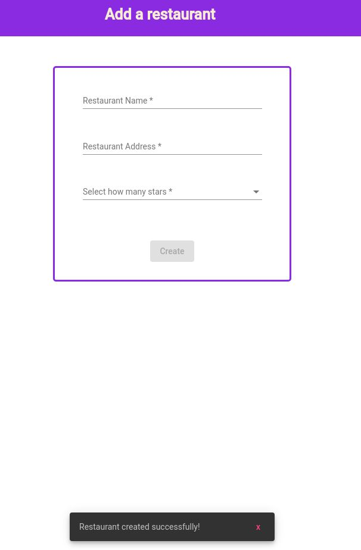

# RestoProject

</img>
</img>
</img>
</img>

--------------------------------------------


# About this project

This is a simple Angular project, performing CRUD operations. Got the idea from a tutorial made by this youtube channel: https://www.youtube.com/channel/UCvHX2bCZG2m9ddUhwxudKYA.

I followed his videos, but the code itself is mine. 

We are using <a href="https://github.com/typicode/json-server">json-server</a> as a database.
I'm also using <a href="https://github.com/ngneat/svg-icon">svg-icon</a> to handle svgs.


Also, i'd like to make clear, the styling and css in general is poorly written, since that was not the focus of this project.
But it is kinda responsive. I'm also using Material UI to handle some stuff, like modals, form styling, etc.


# Running json-server

In the root folder, type on your terminal ```` json-server --watch db.json ```` to start the server. Please, refer to the documentation for more details
on how to perform crud operations.


---------------------------------------------------------------

This project was generated with [Angular CLI](https://github.com/angular/angular-cli) version 10.2.0.

## Development server

Run `ng serve` for a dev server. Navigate to `http://localhost:4200/`. The app will automatically reload if you change any of the source files.

## Code scaffolding

Run `ng generate component component-name` to generate a new component. You can also use `ng generate directive|pipe|service|class|guard|interface|enum|module`.

## Build

Run `ng build` to build the project. The build artifacts will be stored in the `dist/` directory. Use the `--prod` flag for a production build.

## Running unit tests

Run `ng test` to execute the unit tests via [Karma](https://karma-runner.github.io).

## Running end-to-end tests

Run `ng e2e` to execute the end-to-end tests via [Protractor](http://www.protractortest.org/).

## Further help

To get more help on the Angular CLI use `ng help` or go check out the [Angular CLI Overview and Command Reference](https://angular.io/cli) page.
